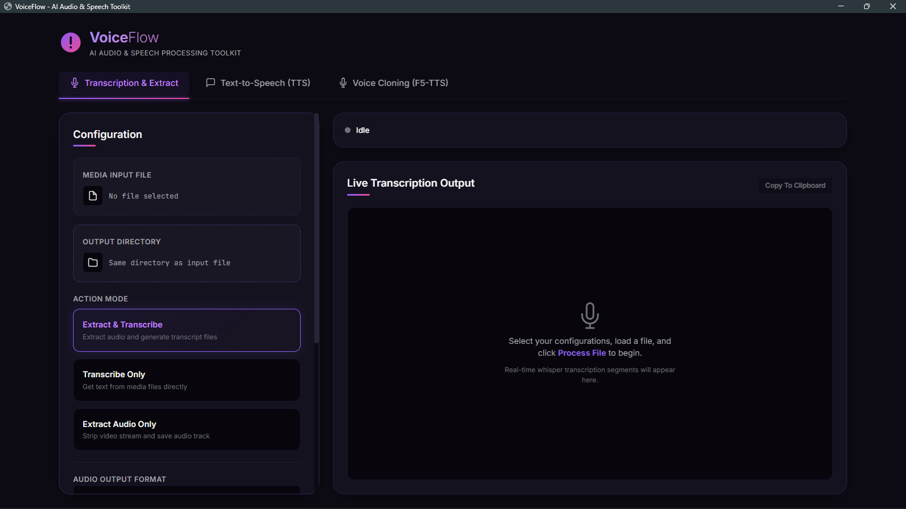

# VoiceFlow - AI Audio & Speech Toolkit

**VoiceFlow** é um kit de ferramentas local e poderoso para processamento de áudio, transcrição inteligente e síntese de voz baseada em Inteligência Artificial. Projetado com uma interface moderna e dark mode responsiva via [Eel](https://github.com/python-eel/Eel), o VoiceFlow integra modelos avançados como **Faster-Whisper** e **F5-TTS** para oferecer resultados profissionais de forma local.



---

## 🚀 Funcionalidades

### 1. Transcrição e Extração de Áudio
*   **Extração de Áudio**: Separe trilhas de áudio de arquivos de vídeo de forma automática usando FFmpeg.
*   **Transcrição Inteligente**: Transcreva áudio e vídeo usando o **Faster-Whisper** com suporte a aceleração por hardware (GPU/CUDA) ou CPU.
*   **Legendas no Estilo TikTok**: Gere legendas dinâmicas curtas e de leitura rápida, ideais para vídeos de formato curto (Reels, TikTok, Shorts). Customize:
    *   **Quantidade Máxima de Palavras**: Limite de palavras por linha (ex: 3 palavras).
    *   **Duração Máxima**: Limite de tempo por legenda (ex: 1.5 segundos).
*   **Formatos de Exportação**: Texto simples (`.txt`), legendas estruturadas (`.srt`) e WebVTT (`.vtt`).
*   **Visualização em Tempo Real**: Veja os blocos transcritos na tela conforme o áudio é processado.

### 2. Conversão de Texto em Fala (TTS)
*   **Vozes Neurais de Alta Qualidade**: Utiliza o motor do `edge-tts` para gerar falas extremamente naturais em português e dezenas de outros idiomas.
*   **Controle Dinâmico**: Ajuste a velocidade da fala (Speed) e o tom da voz (Pitch).
*   **Player Embutido**: Ouça o áudio gerado diretamente pela interface antes de exportar.

### 3. Clonagem de Voz (F5-TTS)
*   **Modelos de Ponta**: Suporta o modelo original F5-TTS e a versão especializada em Português Brasileiro (`firstpixel/F5-TTS-pt-br`).
*   **Auto-Transcrição**: Transcreva o áudio de referência automaticamente com Whisper com apenas um clique.
*   **Filtros Integrados**: Remoção de ruído de fundo do áudio de referência e remoção de silêncios do áudio gerado.

---

## 🛠️ Requisitos e Dependências

Para rodar o VoiceFlow localmente, você precisará de:

*   **Python 3.10+**
*   **FFmpeg** (gerenciado automaticamente pelo pacote `imageio-ffmpeg`)
*   **CUDA Toolkit (opcional, recomendado para GPU)**:
    *   Para aceleração na transcrição e clonagem de voz F5-TTS.

### Dependências principais (instaladas via `requirements.txt`):
*   `eel` (Frontend HTML/JS + Backend Python)
*   `faster-whisper` (Transcrição veloz)
*   `f5-tts` (Clonagem de voz via Flow Matching)
*   `edge-tts` (Síntese de voz da Microsoft)
*   `noisereduce` & `num2words` (Tratamento e pré-processamento de áudio)

---

## 📦 Instalação e Execução

1. **Clone o repositório**:
   ```bash
   git clone https://github.com/seu-usuario/tiktok-dark-tools.git
   cd tiktok-dark-tools
   ```

2. **Crie e ative um ambiente virtual**:
   ```bash
   python -m venv venv
   # No Windows (PowerShell):
   .\venv\Scripts\Activate.ps1
   # No Linux/macOS:
   source venv/bin/activate
   ```

3. **Instale as dependências**:
   ```bash
   pip install -r requirements.txt
   ```

4. **Inicie o aplicativo**:
   ```bash
   python main.py
   ```

---

## 🖥️ Configuração do CUDA (Aceleração por GPU no Windows)

O VoiceFlow já vem pré-configurado para localizar bibliotecas NVIDIA CUDA instaladas no próprio ambiente Python. Se você deseja transcrever e clonar vozes de forma instantânea usando sua GPU GeForce:

1. Certifique-se de que sua placa é compatível com CUDA e que os drivers da NVIDIA estão atualizados.
2. Ao selecionar o dispositivo **GPU (CUDA)** na interface do programa, ele utilizará as bibliotecas CUDA pré-carregadas instaladas via pip (`nvidia-cublas-cu12`, etc).

---

## 📝 Licença

Este projeto é distribuído sob a licença MIT. Consulte o arquivo `LICENSE` para obter mais informações.
